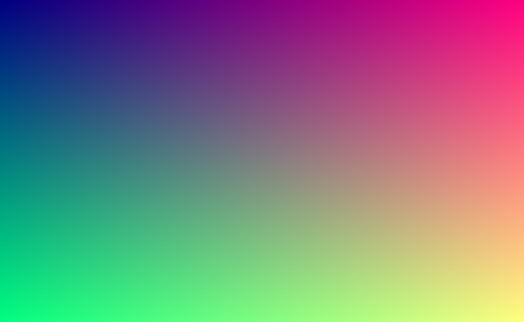

# Software Renderer

用 C++ 从零实现的软光栅化渲染器。不依赖 OpenGL 等图形库，
每一个像素都由自己计算得出。
## 效果展示

### M1 · 画布与 BMP 输出

650×400 的 24 位 BMP，纯 CPU 逐像素计算生成，未使用任何图形库。

## 进度

- [x] M0 环境搭建 —— [笔记](docs/M0-环境搭建.md)
- [x] M1 画布与第一张图 —— [笔记](docs/M1-画布与BMP输出.md)
- [ ] M2 向量、矩阵与线段绘制
- [ ] M3 三角形填充
- [ ] M4 加载 OBJ 模型与线框渲染
- [ ] M5 Z-buffer 深度测试
- [ ] M6 相机与投影矩阵
- [ ] M7 纹理映射
- [ ] M8 Blinn-Phong 光照
- [ ] M9 阴影
- [ ] M10 性能优化与多线程

## 构建

    cmake -S . -B build
    cmake --build build
    ./build/app
