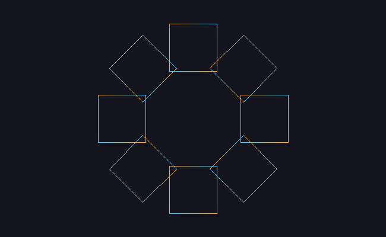

# M2 · 向量、矩阵与线段绘制

> **里程碑**：画布上出现第一条自己算出来的线，并且能让图形按矩阵转身。
> 前置：[M0 环境搭建](M0-环境搭建.md) ｜ [M1 画布与 BMP 输出](M1-画布与BMP输出.md)
> 逐行讲解版：[M2 详解](M2-向量矩阵与线段绘制-详解.md)

## 目标

M1 只做出一块能点亮像素的画布。M2 给它两样东西：

1. **画线的能力** —— 给定两个端点，算出中间该点亮哪些格子（光栅化）。
2. **变换的能力** —— 用向量和矩阵描述"缩放、旋转、平移"。

## 成果



八个方框的四个顶点都在**局部坐标**中定义（以自身中心为原点），再用矩阵 `T(center) · R(θ)` 送入世界坐标，最后用 Bresenham 连线、按 `lerp` 插值颜色。

## 实现

### 1. 基础类型

| 文件 | 内容 |
| --- | --- |
| `src/Vec2.h` | 二维向量：加减、标量乘、点积、长度、单位化 |
| `src/Color.h` | RGB 颜色类型 + 线性插值 `lerp` |
| `src/Mat3.h` / `Mat3.cpp` | 3×3 齐次坐标矩阵：单位、缩放、旋转、平移、乘法、点变换 |

### 2. 画线：两套实现并存

**DDA**（`drawLineDDA`）：每步沿长轴移动一个像素，另一轴按斜率累加浮点。直观、好懂，但每步都要浮点运算，误差会随长度累积。

**Bresenham**（`drawLineBresenham`）：纯整数运算。用一个整数误差项 `err` 跟踪"当前点偏离理想直线多少"，方向由 `sx` / `sy` 两个符号变量表示，没有浮点、没有除法。

两者都支持**颜色插值**：按 `t = i / steps` 在起止颜色之间做 `lerp`。

### 3. 变换

所有变换都写成 3×3 齐次坐标矩阵：

| 变换 | 矩阵形态 |
| --- | --- |
| 平移 (tx, ty) | 第三列填 tx、ty，其余同单位矩阵 |
| 缩放 (sx, sy) | 对角线填 sx、sy，`[2][2] = 1` |
| 旋转 θ | `[0][0]=cosθ`、`[0][1]=−sinθ`、`[1][0]=sinθ`、`[1][1]=cosθ` |

组合规则：`A · B` 表示"**先做 B，再做 A**"（从右往左读），因为 `(A·B)·p = A·(B·p)`。

绕任意点 c 旋转：`T(c) · R · T(−c)` —— 把 c 移到原点、转、再搬回去。

## 坐标约定

- 画布原点在**左上角**，x 向右、**y 向下**。
- 因此数学上的"逆时针"旋转矩阵，在屏幕上看起来是**顺时针**。
- 顶点先在**局部坐标**（以物体自身为中心）中定义，再由模型矩阵送入世界坐标。

## 验证方式

三个自动检查放在独立的测试程序里（`src/tests.cpp` → `~/build-renderer/tests`）：

1. **手算对照**：在 8×4 小画布上画 `(0,0) → (5,2)`，把点亮的像素逐格打印，与手算结果 `(0,0) (1,0) (2,1) (3,1) (4,2) (5,2)` 比对。
2. **差分测试**：DDA 与 Bresenham 各画同一条线 `(40,30) → (600,315)`，理论点数 `max(560,285) + 1 = 561`。实测两个都是 **561**，不一致 **6** 个像素——分歧来自"理想高度正好落在半格上"时的取整方向差异。
3. **不变量测试**：`transformPoint(rot * trans, p)` 必须等于 `transformPoint(rot, transformPoint(trans, p))`。这条等式由矩阵乘法的定义保证，与具体数值无关，换任何矩阵、任何点都成立。

## 踩坑记录

| 现象 | 根因 | 定位方法 |
| --- | --- | --- |
| `conflicting declaration 'uint8_t b'` | 函数签名里两个参数都叫 `b`（线段终点与蓝色分量） | 编译器标出重名位置；端点改名 `from` / `to` |
| 线呈 45° 锯齿、终点不对 | `y1` 误写成 `lround(to.x)`，目标点被换到了别处 | 小画布只点亮 8 个像素，恰好等于 `dx + dy + 1`，说明遍历的是对角线路径 |
| 大画布上两算法只重合 4 个像素 | 同上笔误，加上两方向判断写成了 `if / else if`，斜角步永不执行 | 差分测试算出交集只有 4，说明画的不是同一条线 |
| 所有变换结果都是 `(0, 0)` | `translation` / `rotation` 未从单位矩阵出发，`m[2][2] = 0` 使齐次坐标的 `w` 变成 0 | `transformPoint` 里 `if (w == 0.0) return (0,0)` 是唯一会把结果归零的出口 |
| 组合变换里平移量消失 | 矩阵乘法写成了逐元素相乘，少了行×列点积的内层循环 | 结果与输入 x 成正比（`(11,0)` 的结果正好是 `(1,0)` 的 11 倍），说明矩阵只剩一个对角元素 |
| CMake 报 `Cannot find source file: src/tests.cpp` | 新建文件名的大小写与 CMakeLists 中的路径不一致（Linux 区分大小写） | `ls -l src` 查看磁盘上的真实文件名 |

## 运行方式

```bash
cd /mnt/hgfs/code
cmake -S . -B ~/build-renderer        # 配置（改过 CMakeLists 后必须重跑）
cmake --build ~/build-renderer        # 编译出两个程序

~/build-renderer/app                  # 渲染：字符画预览 + out.bmp
~/build-renderer/tests                # 验证：三组自动检查
```

## 下一步

M3 · 三角形填充：把三条线围成的区域填上颜色，为加载模型与光照做准备。