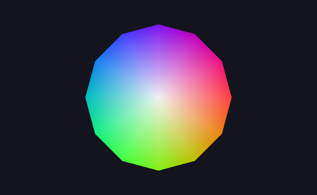

# M3 · 三角形填充

> **里程碑**：从线框到实心面。渲染器开始画"面"，而且面上能做插值。
> 前置：[M0](M0-环境搭建.md) ｜ [M1](M1-画布与BMP输出.md) ｜ [M2](M2-向量矩阵与线段绘制.md)
> 逐行讲解版：[M3 详解](M3-三角形填充-详解.md)

## 目标

M2 只能画线框，M3 让渲染器填充**实心的面**。实现方式只有一种：三角形。

原因是三条硬性事实：

- **三点必共面。** 任意三个不共线的点唯一确定一个平面；四边形可能四点不共面而扭曲。
- **任何多边形都能拆成三角形。** 一个 n 边形可切成 n−2 个三角形，所以"会画三角形"等于"会画一切"。
- **三个顶点正好够做唯一的线性插值。** 多一个顶点，权重就不唯一了。
- 顺带一提，GPU 硬件的光栅化单元也只接受三角形。

## 成果



12 个扇形三角形拼成的色轮：圆心为浅灰，弧上两个顶点按各自角度取色相，整体经矩阵旋转 15° 后送入画布。边缘可见的十二边形棱角，正是"用三角形逼近曲线"的直接证据。

## 实现

### 1. 边界函数：判断点是否在三角形内

```cpp
double edge(const Vec2& a, const Vec2& b, const Vec2& p) {
    return (b.x - a.x) * (p.y - a.y) - (b.y - a.y) * (p.x - a.x);
}
```

这是二维叉积 `(b−a) × (p−a)` 的分量值，几何意义是**三角形 (a, b, p) 的有符号面积的两倍**：

- **符号**：p 在直线 a→b 的哪一侧
- **绝对值**：三点围成的面积

三条边各算一次，三个值同号即在三角形内部（含边界）。

### 2. 重心坐标：把顶点属性插进面里

把三个边界函数的值分别除以总面积，得到的三个数就是**重心坐标** `w0, w1, w2`：

- 位于顶点 p0 时：`w0 = 1`，其余为 0
- 位于三角形中心时：三者都是 `1/3`
- 任意一点恒满足 `w0 + w1 + w2 = 1`

于是任意顶点属性都能平滑插值到面内：

```
c = c0 · w0 + c1 · w1 + c2 · w2
```

权重非负且和为 1，保证插值结果永远落在三个顶点值之间——**不需要额外的钳制（clamp）**，这就是重心坐标插值天然安全的原因。

这套机制之后会反复使用：M5 插值深度值、M7 插值纹理坐标、M8 插值法线。

### 3. 工程细节

| 细节 | 处理方式 | 原因 |
| --- | --- | --- |
| 绕序 | 面积为负时交换后两个顶点（连同颜色一起换） | 统一之后内部判定只需 `>= 0`，不必分情况讨论 |
| 退化三角形 | 面积为 0 直接返回 | 否则会拿 0 做除数，得到 NaN 甚至崩溃 |
| 像素判定 | 用像素**中心** `(x + 0.5, y + 0.5)` | 判定"格子中心是否被覆盖"，边缘覆盖才公平 |
| 包围盒 | 取三顶点的 min / max，再夹到画布范围内 | 避免对整张画布逐像素测试，同时防止越界写内存 |

## 验证方式

| 测试 | 内容 | 结果 |
| --- | --- | --- |
| 边界函数符号 | 线段下方、上方、延长线上、线段上各取一点 | `30 / −30 / 0 / 0`，与手算一致 |
| 面积不变量 | 统计填充像素数，与三角形几何面积比较 | 50100 / 50000 = 1.002（差值来自边界像素的取整方向） |
| 绕序一致性 | 正序与反序绘制同一个三角形，逐像素比较 | 差异 0 |
| 退化情形 | 三个共线顶点 | 填充 0 像素，程序正常结束 |

## 踩坑记录

| 现象 | 根因 |
| --- | --- |
| 边缘缺一格或多出一格 | 判定用了像素左上角而不是像素中心 |
| 三角形整体不出现 | `main.cpp` 里漏了调用，或调用写在背景填充之前被覆盖 |

## 运行方式

```bash
cd /mnt/hgfs/code
cmake -S . -B ~/build-renderer
cmake --build ~/build-renderer

~/build-renderer/app        # 渲染：out.bmp
~/build-renderer/tests      # 验证：全部自动检查
```

## 下一步

M4 · 加载 OBJ 模型与线框渲染：把外部模型文件的顶点读进来，用已有的画线与变换能力把它画出来。